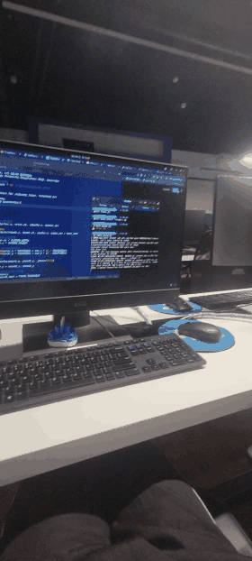
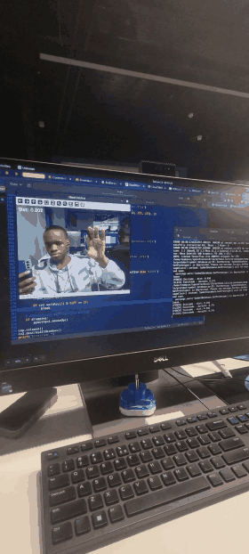

# Hand Mouse

Controle do mouse usando a mão via webcam com **MediaPipe** e **Python**.

---

## Demonstração

Confira abaixo o funcionamento em tempo real:

| Demonstração 1 | Demonstração 2 |
| :---: | :---: |
|  |  |
| *[Ver vídeo original (MP4)](demo/demo_video1.mp4)* | *[Ver vídeo original (MP4)](demo/demo_video2.mp4)* |

---

## Funcionalidades

* Mover cursor com o dedo indicador.
* Click juntando polegar + indicador.
* Arrastar mantendo a pinça por mais de 0.8s.
* Executável standalone ou via Docker.

---

## Como usar

### 1. Rodando direto

```bash
./dist/hand_mouse --background
```

### 2. Usando Docker

```bash
./run_hand_mouse_docker.sh
```

> O script abre o container e conecta ao seu display para mostrar a webcam.

---

## Configuração

Edite o arquivo `hand_mouse.ini` para ajustar:

* `pinch_threshold` – sensibilidade do click
* `click_max_duration` – duração máxima para click rápido
* `drag_min_duration` – duração mínima para arrastar
* `smoothness` – suavização do movimento
* `camera_width`, `camera_height` – resolução da câmera
* `speed_multiplier` – velocidade do cursor

---

## Dependências

* Python 3.11+
* OpenCV
* MediaPipe
* PyAutoGUI
* PyInstaller (para gerar binário)

> Se faltar alguma dependência, use `install_or_build.sh` para instalar ou criar Docker.
